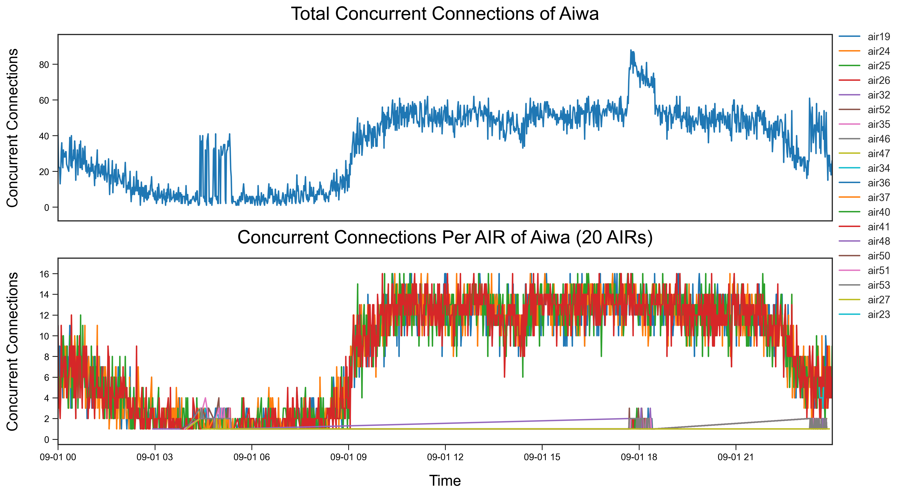

[![LinkedIn][linkedin-shield]][linkedin-url]

<!-- PROJECT LOGO -->
 

  
  <h3 align="center">AIR System KPI Data Analysis Automation</h3>

<!-- TABLE OF CONTENTS -->

  
Table of Contents

  <ol>
    <li>
      <a href="#about-the-project">About The Project</a>
      <ul>
        <li><a href="#business-case">Business Case</a></li>
        <li><a href="#technical-solution">Technical Solution</a></li>
        <li><a href="#feedback">Feedback</a></li>
        <li><a href="#screenshots">Screenshots</a></li>
        <li><a href="#tech-stack">Tech Stack</a></li>
      </ul>
    </li>
    <li><a href="#contact">Contact</a></li>
  </ol>

<!-- ABOUT THE PROJECT -->
## About The Project

* Project Name: AIR System KPI Data Analysis Automation
* Version: v1.0.0
* Organization Department: Technology

### Business Case
Daily capacity utilization analysis for the Ericsson AIR system (Concurrent Connections KPI) used to be a time-consuming manual process, taking approximately 2 hours of work every day. The process involved querying the Oracle database for a large dataset, followed by manual data cleaning, analysis, and graph creation. This automation project reduces the manual effort to just two clicks, saving significant time while generating more comprehensive insights and over 50 visualizations, all in under 5 minutes.

(<a href="#readme-top">back to top</a>)

### Technical Solution
This automated data analysis tool streamlines the entire process from data acquisition to in-depth analysis and visualization of capacity utilization for Ericsson AIR nodes. Key functionalities include:

* Data Acquisition: Automatically retrieves a dataset of approximately 725,000 rows and 7 columns from the Oracle database.
* Data Cleaning: Ensures the dataset is properly cleaned and structured for analysis.
* Capacity Utilization Analysis: Breaks down analysis into two main time windows:
  * Maintenance Window (02:00 AM to 05:59 AM)
  * Operational Window (06:00 AM to 01:59 AM)
* Key Metrics:
  * Maximum Number of Concurrent Connections
  * Maximum Utilization Percentage
  * Peak Time of Maximum Utilization
  * Most Utilized AIR Node
  * Maximum Average and Mode of Concurrent Connections
* Visualizations:
  * Line graphs for capacity utilization across different nodes and services.
  * Bar graphs (both ordered and unordered) for average and maximum capacity utilization.
  * Detailed graphs for each node and service to track concurrent connections.
* Additional Features:
  * Identifies missing AIR nodes for easier investigation by displaying their IP and data collection job.
  * Saves both raw and cleaned datasets as CSV files for future reference or detailed manual review.

(<a href="#readme-top">back to top</a>)

### Feedback

(<a href="#readme-top">back to top</a>)

### Screenshots

(<a href="#readme-top">back to top</a>)

### Tech Stack

This project was developed using the following tech stack:

* Python (Libraries: pandas, numpy, matplotlib, sqlalchemy, etc.)
* VS Code (as the development environment)
* Git (for version control)

(<a href="#readme-top">back to top</a>)

<!-- CONTACT -->
## Contact

Mohamed AbdelGawad Ibrahim - [@m-abdelgawad](https://www.linkedin.com/in/m-abdelgawad/) - <a href="tel:+201069052620">+201069052620</a>

(<a href="#readme-top">back to top</a>)

<!-- MARKDOWN LINKS & IMAGES -->
<!-- https://www.markdownguide.org/basic-syntax/#reference-style-links -->
[linkedin-shield]: https://img.shields.io/badge/-LinkedIn-black.svg?style=for-the-badge&logo=linkedin&colorB=555
[linkedin-url]: https://www.linkedin.com/in/m-abdelgawad/
